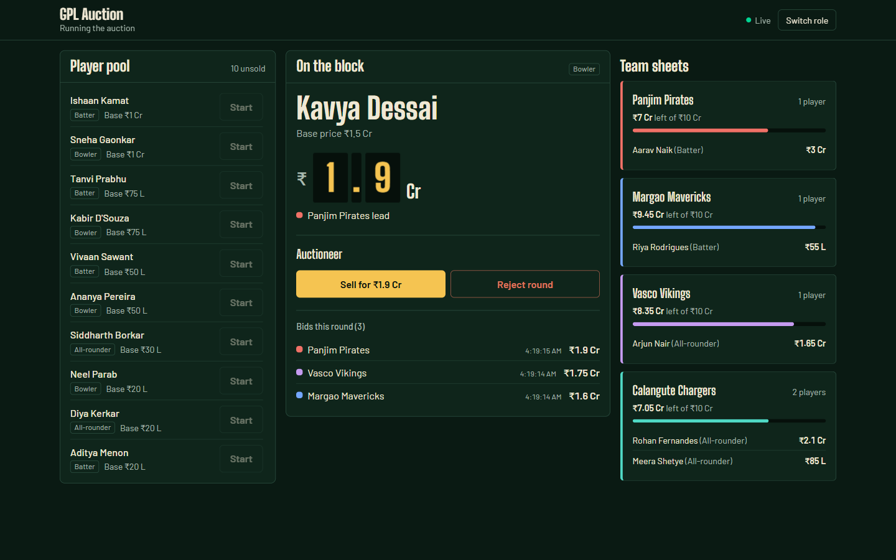
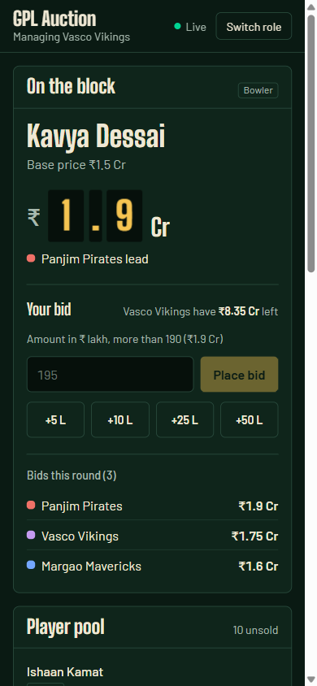
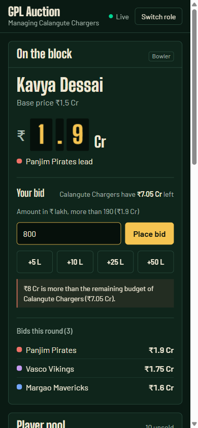
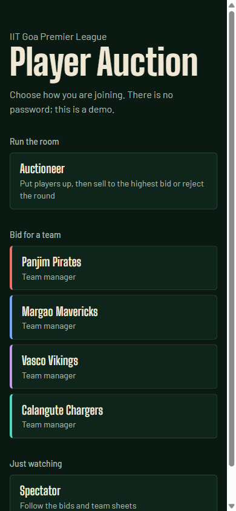
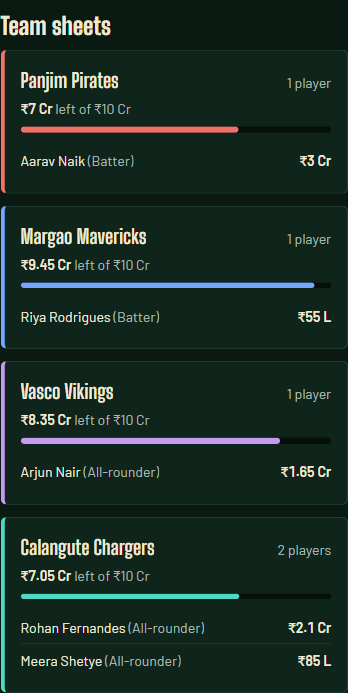

# GPL Auction

[](https://github.com/vikaskumar-23/gpl-auction/actions/workflows/ci.yml)

A live player auction for the **IIT Goa Premier League**. One auctioneer puts players up one at a time, four team managers bid from their phones, and every screen updates the moment a bid lands. Selling a player moves them onto the winning team's sheet at the accepted price and takes that amount off the team's budget. Everything is stored in SQLite, so a refresh or a server restart shows the same rosters and budgets.

**Stack:** FastAPI (Python 3.11) · SQLite · Server-Sent Events · React 19 + Vite · Tailwind CSS v4 · pytest · GitHub Actions · Docker



---

## Contents

- [Run it](#run-it)
- [Tests](#tests)
- [Using the app](#using-the-app)
- [Screenshots](#screenshots)
- [Assumptions](#assumptions)
- [Bid rules](#bid-rules)
- [API reference](#api-reference)
- [Live updates (SSE)](#live-updates-server-sent-events)
- [Database schema](#database-schema)
- [Project structure](#project-structure)
- [Design decisions](#design-decisions)

---

## Run it

Requirements: **Python 3.11+** and **Node 20.19+** (Node is only needed to build the UI).

### Option A: one server (recommended)

Build the UI once, then FastAPI serves the UI, the API and the live stream from one process.

```bash
# 1. Build the frontend
cd frontend
npm ci
npm run build
cd ..

# 2. Install and start the backend
cd backend
python -m venv .venv
.venv\Scripts\activate          # Windows (PowerShell / cmd)
source .venv/bin/activate       # macOS / Linux
pip install -r requirements.txt
uvicorn app.main:app --timeout-graceful-shutdown 1
```

Open **http://127.0.0.1:8000**. Interactive API docs (Swagger) are at **http://127.0.0.1:8000/docs**.

The database file `backend/gpl.db` is created and seeded with 4 teams and 16 players the first time the server starts.

### Option B: development mode (hot reload)

```bash
# terminal 1: API on :8000
cd backend
.venv\Scripts\activate            # or: source .venv/bin/activate
uvicorn app.main:app --reload --timeout-graceful-shutdown 1

# terminal 2: UI on :5173, proxies /api to :8000
cd frontend
npm install
npm run dev
```

Open **http://localhost:5173**.

> `--timeout-graceful-shutdown 1` stops uvicorn from waiting forever on open live-update connections when you press Ctrl+C or it reloads.

### Option C: Docker

```bash
docker build -t gpl-auction .
docker run -p 8000:8000 -e GPL_DB_PATH=/data/gpl.db -v gpl-data:/data gpl-auction
```

The volume keeps the database across container restarts. Open **http://127.0.0.1:8000**.

### Reset the data

Stop the server, delete `backend/gpl.db`, and start it again. It reseeds automatically.

---

## Tests

```bash
cd backend
pip install -r requirements-dev.txt
pytest
```

34 tests, about 3 seconds. Every test runs against its own temporary SQLite file through the real HTTP routes, so the SQL and the schema constraints are tested too, not mocked.

| File | Covers |
|---|---|
| `tests/test_bid_rules.py` | Four managers bidding in turn; bid must beat the base price and the current highest; no bidding twice in a row; over-budget refusal (including after a purchase); unknown team; role check; malformed amounts; **four simultaneous equal bids store exactly one** |
| `tests/test_auctioneer.py` | Start an auction; one auction at a time; **accept moves the player onto the winning roster at the bid price and charges the budget**; accept needs a bid; accept refuses a bid that was just outbid; sold players can't be re-auctioned; reject leaves the player unassigned; rejected bids don't carry over; **rosters and budgets survive a restart** |
| `tests/test_read_api.py` | Players, rosters and current auction endpoints |
| `tests/test_db.py` | Seeding runs once; schema rejects invalid skills, two players in auction, inconsistent sold rows, negative budgets, unknown foreign keys |

CI runs ruff and pytest, lints and builds the frontend, and builds and smoke-tests the Docker image on every push.

---

## Using the app

The first screen is a role picker. There is no login or password, as the brief asked.

| Role | What they see and do |
|---|---|
| **Auctioneer** | Presses **Start** next to a player in the pool, watches bids arrive, then **Sell for ₹X** (accepts the highest bid) or **Reject round**. Both ask for confirmation. |
| **Team manager** (4) | Sees the player on the block and the price to beat, enters an amount in ₹ lakh (or taps +5 / +10 / +25 / +50) and presses **Place bid**. Errors from the server, such as going over budget, appear right under the bid box. |
| **Spectator** | Sees the board and team sheets, with no controls. |

To simulate the room on one machine, open several browser tabs: one auctioneer, two to four managers and a spectator. The choice is remembered per tab across refreshes, and **Switch role** goes back to the picker.

---

## Screenshots

**Desktop, auctioneer:** player pool, the player on the block with the highest bid as scoreboard plates, and team sheets with budgets (top of this page).

| Manager on a phone | Over-budget bid refused | Choosing a role |
|---|---|---|
|  |  |  |

**Team sheets (rosters):** each team's players with the price paid, and the budget left.



---

## Assumptions

- **Money unit:** whole **₹ lakh** (integers, no rounding issues). The UI shows IPL-style amounts: `75` is ₹75 L, `150` is ₹1.5 Cr.
- **Team budgets:** each of the 4 teams starts with **₹10 Cr (1000 lakh)**. Total base prices are ₹12.2 Cr, so budgets really do limit what teams can buy.
- **Teams:** Panjim Pirates, Margao Mavericks, Vasco Vikings, Calangute Chargers.
- **Players:** 16 preloaded (the brief asks for at least 12):

| # | Player | Skill | Base |
|---|---|---|---|
| 1 | Aarav Naik | batting | ₹2 Cr |
| 2 | Kavya Dessai | bowling | ₹1.5 Cr |
| 3 | Rohan Fernandes | both | ₹1.5 Cr |
| 4 | Ishaan Kamat | batting | ₹1 Cr |
| 5 | Sneha Gaonkar | bowling | ₹1 Cr |
| 6 | Arjun Nair | both | ₹1 Cr |
| 7 | Tanvi Prabhu | batting | ₹75 L |
| 8 | Kabir D'Souza | bowling | ₹75 L |
| 9 | Meera Shetye | both | ₹50 L |
| 10 | Vivaan Sawant | batting | ₹50 L |
| 11 | Ananya Pereira | bowling | ₹50 L |
| 12 | Siddharth Borkar | both | ₹30 L |
| 13 | Riya Rodrigues | batting | ₹30 L |
| 14 | Neel Parab | bowling | ₹20 L |
| 15 | Diya Kerkar | both | ₹20 L |
| 16 | Aditya Menon | batting | ₹20 L |

- **Identity is simulated.** The client says who it is with an `X-Role` header (`auctioneer`, `manager`, `viewer`), and the API refuses actions the role isn't allowed (403). This makes the roles table enforceable without building authentication, which the brief rules out.

---

## Bid rules

Checked on the server, in this order, inside one database transaction (`BEGIN IMMEDIATE`). Two simultaneous bids therefore can't both read the same "highest bid" and both win; a test fires four equal bids at the same instant and checks that exactly one is stored.

1. Only a **team manager** can bid (`403 FORBIDDEN`).
2. A player must be **on the block** (`409 NO_ACTIVE_AUCTION`).
3. The team must exist (`404 TEAM_NOT_FOUND`).
4. A team that **already holds the highest bid** can't bid again until another team outbids it (`409 ALREADY_HIGHEST_BIDDER`).
5. The amount must be **more than the base price** (`400 BID_NOT_ABOVE_BASE`). Equal to the base is not enough, per the brief's "greater than".
6. The amount must be **more than the current highest bid** (`400 BID_NOT_ABOVE_HIGHEST`). There is no minimum raise beyond that.
7. The amount must **not exceed the team's remaining budget** (`400 OVER_BUDGET`). Bidding exactly the remaining budget is allowed.

Rejected bids are never stored, so the bid list only ever holds strictly increasing amounts.

**Auctioneer rules**

- **One auction at a time.** Starting a second player is refused (`409 AUCTION_IN_PROGRESS`), and the database also has a unique index allowing only one player `in_auction`.
- **Accept** sells to the highest bid. The request names the bid id the auctioneer saw. If a higher bid arrived in the meantime, the sale is refused (`409 BID_NOT_HIGHEST`) instead of selling at a price nobody confirmed. Accepting marks the player `sold` with the price and team, and subtracts the price from the team's remaining budget.
- **Reject** puts the player back in the pool unassigned. That round's bids are kept for history but marked `voided`, so if the player is auctioned again, bidding starts fresh.

---

## API reference

- Base path: `/api`. Requests and responses are JSON. **All amounts are whole ₹ lakh.**
- Identity header: `X-Role: auctioneer | manager | viewer`. A missing header means viewer.
- Every error has the same shape, with a stable `code` for programs and a readable `message` for people:

```json
{ "error": { "code": "OVER_BUDGET", "message": "₹20 Cr is more than the remaining budget of Vasco Vikings (₹10 Cr)." } }
```

| Method | Path | Who | Purpose |
|---|---|---|---|
| GET | [`/api/players`](#get-apiplayers) | anyone | List all players |
| GET | [`/api/teams`](#get-apiteams) | anyone | Team rosters and budgets |
| GET | [`/api/auction`](#get-apiauction) | anyone | Player on the block and this round's bids |
| POST | [`/api/auction/start`](#post-apiauctionstart) | auctioneer | Put a player up for auction |
| POST | [`/api/auction/bids`](#post-apiauctionbids) | manager | Place a bid |
| POST | [`/api/auction/accept`](#post-apiauctionaccept) | auctioneer | Sell to the highest bid |
| POST | [`/api/auction/reject`](#post-apiauctionreject) | auctioneer | Reject the round |
| GET | [`/api/events`](#live-updates-server-sent-events) | anyone | Live updates (SSE) |

Generated OpenAPI docs are also served at `/docs`.

### Response objects

```jsonc
// Player
{ "id": 3, "name": "Rohan Fernandes", "skill": "both", "base_price": 150,
  "status": "sold", "sold_price": 200, "team_id": 4 }
// skill: "batting" | "bowling" | "both"; status: "available" | "in_auction" | "sold"
// sold_price and team_id are null unless status is "sold"

// Bid
{ "id": 6, "player_id": 2, "team_id": 2, "team_name": "Margao Mavericks",
  "amount": 175, "created_at": "2026-10-06T22:43:58.420Z" }   // created_at: UTC, ISO 8601

// Team
{ "id": 4, "name": "Calangute Chargers", "total_budget": 1000, "remaining_budget": 800,
  "players": [ /* Player objects bought by this team, most expensive first */ ] }

// Auction
{ "player": /* Player or null */, "bids": [ /* this round's Bid objects, highest first */ ] }
```

### GET /api/players

All players ordered by id. The UI's "Player pool" shows those with `status: "available"`.

- **Request body:** none
- **Success:** `200 OK`, `Player[]`

```json
[{ "id": 1, "name": "Aarav Naik", "skill": "batting", "base_price": 200, "status": "available", "sold_price": null, "team_id": null }]
```

- **Errors:** none specific (only `500` on a server fault)

### GET /api/teams

Every team with its budget and the players it has bought.

- **Request body:** none
- **Success:** `200 OK`, `Team[]`

```json
[{ "id": 4, "name": "Calangute Chargers", "total_budget": 1000, "remaining_budget": 800,
   "players": [{ "id": 3, "name": "Rohan Fernandes", "skill": "both", "base_price": 150, "status": "sold", "sold_price": 200, "team_id": 4 }] }]
```

- **Errors:** none specific

### GET /api/auction

The player currently on the block and this round's bids. `bids[0]` is the highest.

- **Request body:** none
- **Success:** `200 OK`, `Auction`

```json
{ "player": { "id": 2, "name": "Kavya Dessai", "skill": "bowling", "base_price": 150, "status": "in_auction", "sold_price": null, "team_id": null },
  "bids": [
    { "id": 6, "player_id": 2, "team_id": 2, "team_name": "Margao Mavericks", "amount": 175, "created_at": "2026-10-06T22:43:58.420Z" },
    { "id": 5, "player_id": 2, "team_id": 1, "team_name": "Panjim Pirates", "amount": 160, "created_at": "2026-10-06T22:43:58.407Z" } ] }
```

When nothing is on the block: `{ "player": null, "bids": [] }`.

- **Errors:** none specific

### POST /api/auction/start

Put an available player up for auction.

- **Header:** `X-Role: auctioneer`
- **Request body:** `{ "player_id": 2 }`
- **Success:** `200 OK`, `Auction` (the player with `status: "in_auction"` and `bids: []`)

| Status | Code | When |
|---|---|---|
| 403 | `FORBIDDEN` | `X-Role` is not `auctioneer` |
| 422 | `VALIDATION_ERROR` | `player_id` missing or not an integer |
| 409 | `AUCTION_IN_PROGRESS` | Another player is already on the block |
| 404 | `PLAYER_NOT_FOUND` | No player with that id |
| 409 | `PLAYER_NOT_AVAILABLE` | The player has already been sold |

### POST /api/auction/bids

Place a bid for a team on the player currently on the block.

- **Header:** `X-Role: manager`
- **Request body:** `{ "team_id": 3, "amount": 185 }`. `amount` is in ₹ lakh and must be a positive integer.
- **Success:** `201 Created`, the stored `Bid` (now the highest)

```json
{ "id": 7, "player_id": 2, "team_id": 3, "team_name": "Vasco Vikings", "amount": 185, "created_at": "2026-10-06T22:50:12.031Z" }
```

| Status | Code | When |
|---|---|---|
| 403 | `FORBIDDEN` | `X-Role` is not `manager` |
| 422 | `VALIDATION_ERROR` | `team_id` or `amount` missing, not an integer, or `amount` ≤ 0 |
| 409 | `NO_ACTIVE_AUCTION` | No player is on the block |
| 404 | `TEAM_NOT_FOUND` | No team with that id |
| 409 | `ALREADY_HIGHEST_BIDDER` | This team already holds the highest bid |
| 400 | `BID_NOT_ABOVE_BASE` | `amount` ≤ the player's base price |
| 400 | `BID_NOT_ABOVE_HIGHEST` | `amount` ≤ the current highest bid |
| 400 | `OVER_BUDGET` | `amount` > the team's remaining budget |

### POST /api/auction/accept

Sell the player on the block to the highest bid.

- **Header:** `X-Role: auctioneer`
- **Request body:** `{ "bid_id": 7 }`. This must be the current highest bid.
- **Success:** `200 OK`, the sold `Player`

```json
{ "id": 2, "name": "Kavya Dessai", "skill": "bowling", "base_price": 150, "status": "sold", "sold_price": 185, "team_id": 3 }
```

Side effects: the team's `remaining_budget` drops by `sold_price`, the player appears in that team's `players`, and the block is empty again.

| Status | Code | When |
|---|---|---|
| 403 | `FORBIDDEN` | `X-Role` is not `auctioneer` |
| 422 | `VALIDATION_ERROR` | `bid_id` missing or not an integer |
| 409 | `NO_ACTIVE_AUCTION` | No player is on the block |
| 409 | `NO_BIDS` | Nobody has bid yet (reject the round instead) |
| 409 | `BID_NOT_HIGHEST` | A higher bid arrived since the auctioneer looked; nothing is sold |

### POST /api/auction/reject

End the round without a sale. The player goes back to the pool.

- **Header:** `X-Role: auctioneer`
- **Request body:** none
- **Success:** `200 OK`, the `Player` with `status: "available"`, `team_id: null`, `sold_price: null`

| Status | Code | When |
|---|---|---|
| 403 | `FORBIDDEN` | `X-Role` is not `auctioneer` |
| 409 | `NO_ACTIVE_AUCTION` | No player is on the block |

---

## Live updates (Server-Sent Events)

`GET /api/events` returns a `text/event-stream`. The browser opens it with the built-in `EventSource`, which reconnects on its own.

| Event | When | `data` payload |
|---|---|---|
| `state` | Once on connect, then after every successful start, bid, accept or reject | `{ "players": Player[], "teams": Team[], "auction": Auction }`, the whole board in one object |
| `ping` | After 15 s with no `state` event | `1` |

```
event: state
data: {"players": [...], "teams": [...], "auction": {"player": {...}, "bids": [...]}}

event: ping
data: 1
```

The server pushes the full state rather than small diffs, so a client can never drift out of sync. A reconnect simply brings a fresh snapshot. The `ping` lets the client notice a connection that died silently (for example a phone switching Wi-Fi): if nothing arrives for 40 s, it reopens the stream and the "Live" badge turns red in the meantime. Lines starting with `:` are keep-alive comments that clients ignore.

---

## Database schema

SQLite, a single file at `backend/gpl.db` (set `GPL_DB_PATH` to move it). Foreign keys are enforced (`PRAGMA foreign_keys = ON`). Source: [`backend/app/schema.sql`](backend/app/schema.sql).

```sql
CREATE TABLE teams (
    id               INTEGER PRIMARY KEY,
    name             TEXT    NOT NULL UNIQUE,
    total_budget     INTEGER NOT NULL CHECK (total_budget > 0),
    remaining_budget INTEGER NOT NULL,
    CHECK (remaining_budget BETWEEN 0 AND total_budget)
);

CREATE TABLE players (
    id         INTEGER PRIMARY KEY,
    name       TEXT    NOT NULL,
    skill      TEXT    NOT NULL CHECK (skill IN ('batting', 'bowling', 'both')),
    base_price INTEGER NOT NULL CHECK (base_price > 0),
    status     TEXT    NOT NULL DEFAULT 'available'
                       CHECK (status IN ('available', 'in_auction', 'sold')),
    sold_price INTEGER CHECK (sold_price > 0),
    team_id    INTEGER REFERENCES teams (id),
    CHECK (
        (status = 'sold'  AND team_id IS NOT NULL AND sold_price IS NOT NULL) OR
        (status <> 'sold' AND team_id IS NULL     AND sold_price IS NULL)
    )
);

-- one auction at a time
CREATE UNIQUE INDEX one_player_in_auction ON players (status) WHERE status = 'in_auction';

CREATE TABLE bids (
    id         INTEGER PRIMARY KEY,
    player_id  INTEGER NOT NULL REFERENCES players (id),
    team_id    INTEGER NOT NULL REFERENCES teams (id),
    amount     INTEGER NOT NULL CHECK (amount > 0),
    created_at TEXT    NOT NULL DEFAULT (strftime('%Y-%m-%dT%H:%M:%fZ', 'now')),
    voided     INTEGER NOT NULL DEFAULT 0 CHECK (voided IN (0, 1))
);
```

### teams

| Column | Type | Key | Constraints / notes |
|---|---|---|---|
| `id` | INTEGER | **PK** | |
| `name` | TEXT | | NOT NULL, UNIQUE |
| `total_budget` | INTEGER | | NOT NULL, > 0 (₹ lakh) |
| `remaining_budget` | INTEGER | | NOT NULL, between 0 and `total_budget` |

### players

| Column | Type | Key | Constraints / notes |
|---|---|---|---|
| `id` | INTEGER | **PK** | |
| `name` | TEXT | | NOT NULL |
| `skill` | TEXT | | NOT NULL, one of `batting`, `bowling`, `both` |
| `base_price` | INTEGER | | NOT NULL, > 0 (₹ lakh) |
| `status` | TEXT | | NOT NULL, default `available`; one of `available`, `in_auction`, `sold`; **at most one row `in_auction`** (partial unique index) |
| `sold_price` | INTEGER | | NULL until sold, then > 0 |
| `team_id` | INTEGER | **FK → teams.id** | NULL until sold |
| *(row check)* | | | `sold` ⇔ `team_id` and `sold_price` are both set |

### bids

| Column | Type | Key | Constraints / notes |
|---|---|---|---|
| `id` | INTEGER | **PK** | |
| `player_id` | INTEGER | **FK → players.id** | NOT NULL |
| `team_id` | INTEGER | **FK → teams.id** | NOT NULL |
| `amount` | INTEGER | | NOT NULL, > 0 (₹ lakh) |
| `created_at` | TEXT | | NOT NULL, UTC ISO 8601 timestamp (the brief's "time"), set by the database |
| `voided` | INTEGER | | NOT NULL, 0 or 1. `1` marks bids from a rejected round, so they never count again |

Rules that span tables, such as "bid above the current highest" and "within the remaining budget", are checked in [`backend/app/auction.py`](backend/app/auction.py) inside a write transaction. The schema constraints are a second line of defence.

---

## Project structure

```
.
├── backend/
│   ├── app/
│   │   ├── main.py       # FastAPI app: routes, role check, error format, SSE, serves the built UI
│   │   ├── auction.py    # all auction rules and queries
│   │   ├── db.py         # SQLite connection and write transactions
│   │   ├── schema.sql    # tables and constraints
│   │   ├── schemas.py    # request/response models (validation + /docs)
│   │   └── seed.py       # 4 teams, 16 players, inserted once
│   ├── tests/            # pytest suite (see Tests)
│   └── requirements*.txt
├── frontend/
│   └── src/
│       ├── App.jsx                 # role gate and board layout
│       ├── lib/                    # api client, live-state hook, session, money formatting
│       └── components/             # RolePicker, Header, AuctionStage, BidBox,
│                                   # AuctioneerPanel, PlayerList, Rosters, ui
├── Dockerfile                      # builds the UI, then runs FastAPI serving it
└── .github/workflows/ci.yml        # backend tests, frontend lint/build, Docker smoke test
```

---

## Design decisions

| Choice | Why |
|---|---|
| **FastAPI** | Pydantic validates every request body, which gives clear 422s. It generates OpenAPI docs and has built-in SSE support. `TestClient` makes the API tests short. |
| **SQLite + stdlib `sqlite3`** | The data survives restarts with no database server to install. It provides real constraints and real transactions. About ten SQL queries didn't justify an ORM. |
| **`BEGIN IMMEDIATE` per write** | Takes the write lock before reading the current highest bid, so simultaneous bids are handled one at a time. |
| **SSE, not WebSockets or polling** | Updates only flow from server to browsers. `EventSource` is built in and reconnects automatically, and it works through ordinary HTTP proxies. |
| **Push the full state** | One source of truth on the client; there's no "event arrived, now refetch" race. The payload is a few KB. |
| **Accept by bid id** | Prevents selling at a price the auctioneer never saw. |
| **React + Vite, Tailwind** | One responsive board whose panels depend on the role. No router or state library is needed because the server pushes everything. |
| **One process in production** | FastAPI serves the built UI, so the UI and API share one origin and there's no CORS setup. |

**Known limits, deliberately out of scope:**
- The live-update change counter lives in memory, so the app runs as one server process. Several workers would need a shared channel such as Redis pub/sub.
- Identity is a header the client chooses. That's what the brief asks for, not real security.
- SQLite allows one writer at a time, which is fine for a single auction room.
